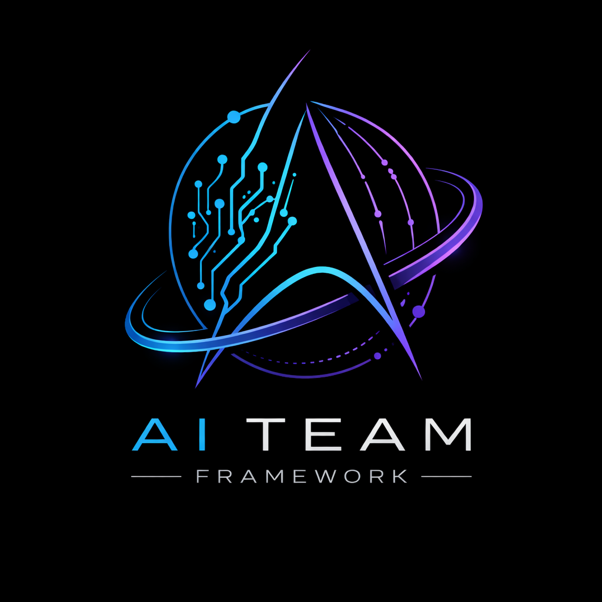

<p align="center">
  
</p>

<h1 align="center">AI Team Framework</h1>

<p align="center"><strong>Orchestrate Claude Code into a team of specialized AI roles — through markdown files alone.</strong></p>

<p align="center"><em>Clone &rarr; Run the wizard &rarr; Ship your first AI-coordinated cycle in 5 minutes.</em></p>

AI Team Framework splits a single Claude Code session into **four specialized roles** — strategy, architecture, implementation, and review — each running in its own session with strict document ownership and zero shared memory. No server. No database. No API keys. Just markdown files, the Claude Code CLI, and a human dispatcher who stays in control.

The result: traceable, repeatable, production-grade software delivery driven by AI on **Linux**.

---

## Why This Exists

Claude Code is powerful, but a single session has limits: context windows overflow, decisions get forgotten, quality drifts without review. Asking one session to be strategist, architect, coder, and reviewer simultaneously leads to unfocused output.

**AI Team Framework solves this by separation of concerns:**

| Role | Responsibility | Writes to |
|------|---------------|-----------|
| **Project Director** | Strategy, priorities, milestones | `DIRECTIVES/`, `PROJECT_STATUS.md` |
| **Development Director** | Architecture, task breakdown, code review | `TODO.md`, `DECISIONS.md` |
| **Development Team** | Implementation, testing, reporting | Source code, `REPORTS/` |
| **Documentation Optimizer** | Token management, archival, knowledge retrieval | `ARCHIVE/`, `OPTIMIZATION_LOG.md` |

Each role is a separate Claude Code session that reads specific documents, does its job, and writes results — with no memory between sessions. Documents carry all state.

### Why not just use one long AI session?

| | Single session | AI Team Framework |
|---|---|---|
| **Context window** | Overflows on large projects | Each role gets a fresh, focused window |
| **Decision memory** | Forgotten after session ends | Persisted in `DECISIONS.md` forever |
| **Code review** | Self-reviewing own code | DD reviews Team's code — separate session, fresh eyes |
| **Quality drift** | Gets sloppy as context grows | Stateless sessions = consistent quality |
| **Traceability** | "I think I changed that file..." | Every directive, decision, and report is documented |
| **Parallelism** | One thing at a time | Worktree delegation enables parallel implementation |
| **Token cost** | One huge expensive session | Smaller focused sessions, token-aware optimization |

---

## Key Features

### Autonomous AI Orchestration
- **4 specialized roles** with strict separation of concerns — no role can step outside its authority
- **Document-driven communication** — roles talk through markdown files, creating a complete audit trail
- **Stateless sessions** — every session starts fresh from documents, eliminating context drift
- **Decision authority matrix** — clear rules for who decides what (strategic vs. technical vs. trivial)
- **Auto-orchestrator** — watches document state, recommends next role, auto-runs cycles with confirmation at quality gates

### Interactive Setup Wizard
- **21-question guided setup** — walks you through project configuration one question at a time
- **Generates 9-12 customized files** — role definitions, state files, format references, launcher script
- **Tech-stack-aware defaults** — suggests conventions based on your language and framework
- **Configurable autonomy** — choose how much control you keep vs. delegate to AI roles

### Context Protection & Token Economy
- **DD never runs full test suites** — delegates heavy operations to Team sessions, preserving context for decisions
- **Concrete document size thresholds** — DO monitors line counts and triggers optimization before sessions get expensive
- **Operational knowledge preservation** — lessons learned are extracted as guidelines before archiving, so the team gets smarter over time
- **Cumulative token savings tracking** — DO reports exact savings after each optimization pass

### Worktree-Based Parallel Implementation
- **Git worktree delegation** — DD can assign phases to isolated worktrees for parallel development
- **Surgical merge protocol** — never copy whole files; review diffs, cherry-pick hunks, verify no leaks
- **Agent regression checklist** — DD scans for hardcoded values, duplicated logic, loose assertions, scope creep

### Document Validation
- **Markdown linter** — validates TODO checkboxes, directive/report statuses, naming conventions, cross-references before role handoff
- **Auto-fix mode** — removes trailing whitespace, adds missing final newlines
- **Strict mode** — treats warnings as errors for CI integration

### Documentation Lifecycle Management
- **Archive-never-delete philosophy** — completed work moves to searchable archive, never lost
- **Knowledge retrieval service** — any role can request past decisions or reports through the dispatcher
- **Automatic archive indexing** — every archived item is indexed by type, date, and summary

### Framework Updates
- **Single config file** — `.ai-team-config.yml` stores all project preferences; updates read it directly instead of AI-extracting from files
- **Deterministic regeneration** — config + new templates = predictable output, no AI guesswork during updates
- **Smart preservation** — stateful files (decisions, status, TODO) are never touched; only role definitions are regenerated
- **Full backup + rollback** — backup created before every update, one-command restore if needed
- **Automatic migration** — projects created before config support get `.ai-team-config.yml` generated on first update

---

## How It Works

```
┌─────────────┐    DIRECTIVES/    ┌─────────────────┐     TODO.md      ┌──────────────┐
│   Project    │ ───────────────► │   Development    │ ──────────────► │  Development  │
│   Director   │                  │    Director      │                  │     Team      │
│  (strategy)  │ ◄─────────────── │  (architecture)  │ ◄────────────── │   (code)      │
└─────────────┘  PROJECT_STATUS   └─────────────────┘    REPORTS/      └──────────────┘
                                         │
                                         │ reviews via
                                         │ DECISIONS.md
                                         ▼
                                  ┌──────────────────────────────────────────────┐
                                  │         Documents (source of truth)          │
                                  └──────────────────────────────────────────────┘
                                         ▲                    │
                                   reads │                    │ optimizes + archives
                                         │                    ▼
                                    You (dispatcher)    Doc Optimizer
                                    start sessions,     (knowledge curator,
                                    carry context       optional)
```

### The Cycle

```
1. PD session   →  Reviews state, issues directive         (./start_role.sh pd)
2. DD session   →  Reads directive, creates TODO tasks     (./start_role.sh dd)
3. Team session →  Implements, writes report               (./start_role.sh team)
4. DD session   →  Reviews report, issues verdict          (./start_role.sh dd)
5. PD session   →  Updates status, decides next steps      (./start_role.sh pd)
   └── Repeat
*. DO session   →  Optimizes docs, archives completed      (./start_role.sh doc)
```

You (the human dispatcher) start each session and tell the role what happened since last time. Each role reads its documents and picks up where the previous session left off. You stay in full control — the AI team works for you, not the other way around.

Or let the **orchestrator** handle it:

```bash
./scripts/orchestrator.sh              # Show status dashboard + recommendation
./scripts/orchestrator.sh suggest      # Just tell me what to run next
./scripts/orchestrator.sh auto         # Auto-run roles with confirmation prompts
./scripts/orchestrator.sh auto --no-confirm  # Auto-advance, confirm only at quality gates
./start_role.sh backup                       # Create timestamped project backup
```

---

## Prerequisites

- **Linux** (tested on Ubuntu/Debian; should work on any Linux with bash)
- [**Claude Code**](https://docs.anthropic.com/en/docs/claude-code) CLI installed and available as `claude`

---

## Quick Start (5 Minutes)

### 1. Clone the framework

```bash
git clone https://github.com/dusankrstic-cpu/ai-team-framework.git
```

### 2. Run the Wizard in your project

```bash
cd /path/to/your-project
claude "$(cat /path/to/ai-team-framework/wizard/WIZARD.md)"
```

Or use the launcher script:

```bash
/path/to/ai-team-framework/scripts/start_role.sh wizard
```

The Wizard asks 21 questions about your project — name, tech stack, conventions, phases, autonomy level, review strictness, CLI flags — then generates a complete `docs/TEAM/` directory with everything you need.

### 3. Start your first cycle

```bash
chmod +x start_role.sh
./start_role.sh pd     # Start a Project Director session
```

The PD reviews the initial state and issues the first directive. From there, follow the cycle.

---

## Lite Mode vs Full Mode

You don't have to adopt all four roles at once. Start small and scale up when you need it.

### Lite Mode — 2 roles (DD + Team)

Best for solo developers or small projects where you own the strategy yourself.

```
You (strategy + dispatch)
  │
  ├─► DD session  →  Breaks down tasks, reviews code     (./start_role.sh dd)
  └─► Team session →  Implements, writes report           (./start_role.sh team)
```

Skip PD — you decide priorities directly. Skip DO — manage documents yourself.
The Wizard still generates all files; you just don't run PD or DO sessions.

### Full Mode — 4 roles (PD + DD + Team + DO)

Best for larger projects, teams, or when you want full delegation with audit trail.

```
PD  →  DD  →  Team  →  DD (review)  →  PD (status)  →  repeat
                                                         DO (optimize)
```

All roles active. Orchestrator automates the cycle. Full traceability and token optimization.

| | Lite Mode | Full Mode |
|---|---|---|
| **Roles** | DD + Team | PD + DD + Team + DO |
| **Strategy decisions** | You decide | PD decides, you approve |
| **Code review** | DD reviews | DD reviews |
| **Document optimization** | Manual | DO automates |
| **Orchestrator** | Optional | Recommended |
| **Best for** | Solo/small projects | Multi-phase projects |

---

<details>
<summary><strong>What Gets Generated</strong></summary>

```
your-project/
├── .ai-team-config.yml                  # All project preferences (source of truth)
├── docs/TEAM/
│   ├── PROJECT_DIRECTOR.md              # PD role definition
│   ├── DEVELOPMENT_DIRECTOR.md          # DD role definition
│   ├── DEVELOPMENT_TEAM.md              # Team role definition
│   ├── PROJECT_STATUS.md                # Shared state (PD + DD sections)
│   ├── DECISIONS.md                     # DD's permanent memory
│   ├── TODO.md                          # Task backlog
│   ├── ARCHITECTURE_VISION.md           # Technical north star
│   ├── DIRECTIVE_TEMPLATE.md            # Format reference
│   ├── REPORT_TEMPLATE.md              # Format reference
│   ├── DIRECTIVES/                      # PD's strategic directives
│   ├── REPORTS/                         # Team's implementation reports
│   ├── DOC_OPTIMIZER.md                 # DO role definition (if enabled)
│   ├── OPTIMIZATION_LOG.md              # DO's permanent memory (if enabled)
│   ├── ARCHIVE_INDEX.md                 # Archive master index (if enabled)
│   └── ARCHIVE/                         # Archived documents (if enabled)
└── start_role.sh                        # Launcher script with your CLI flags
```

Every file is customized for your project — your name, your tech stack, your conventions, your phases.
</details>

<details>
<summary><strong>Document Ownership Matrix</strong></summary>

No ambiguity about who writes what:

| Document | PD | DD | Team | DO |
|----------|-----|-----|------|-----|
| DIRECTIVES/ | **writes** | reads | reads | archives completed |
| PROJECT_STATUS.md §2 | reads | **writes** | reads | — |
| PROJECT_STATUS.md §1,3-9 | **writes** | reads | reads | — |
| DECISIONS.md | reads | **writes** | reads | optimizes completed |
| TODO.md (text) | reads | **writes** | reads | optimizes completed |
| TODO.md (checkboxes) | reads | reads | **writes** | — |
| REPORTS/ | reads | reads | **writes** | archives completed |
| OPTIMIZATION_LOG.md | reads | reads | — | **writes** |
| ARCHIVE/ | reads | reads | reads | **writes** |
| Source code | — | — | **writes** | — |
</details>

<details>
<summary><strong>Configuration Options</strong></summary>

All preferences are stored in `.ai-team-config.yml` — a single YAML file generated by the Wizard. You can edit it manually to change preferences without re-running the Wizard. The update script reads this file to regenerate role definitions deterministically.

The Wizard lets you tune the framework to your workflow:

| Setting | Options | Effect |
|---------|---------|--------|
| **Claude CLI flags** | Default / `--dangerously-skip-permissions` / Custom | Baked into `start_role.sh` |
| **Autonomy level** | Strict / Moderate / High | How much DD can decide without PD |
| **Review strictness** | Strict / Moderate / Lenient | How rigorous code reviews are |
| **Dispatcher control** | Full / PD+DD / PD only | How many roles you run manually |
| **Doc Optimizer** | Enabled / Disabled | Token management and archival system |

Override CLI flags per session:
```bash
CLAUDE_FLAGS="--model claude-sonnet-4-6" ./start_role.sh team
```
</details>

<details>
<summary><strong>Updating an Existing Project</strong></summary>

When a new framework version is released:

```bash
cd /path/to/ai-team-framework
git pull
./scripts/update_project.sh /path/to/your-project
```

The update script:
- Shows a disclaimer and requires confirmation (your project is in active use)
- Creates a full backup to `.framework_backup_TIMESTAMP/`
- Reads `.ai-team-config.yml` for project customizations (deterministic — no AI extraction needed)
- Regenerates role definitions using new templates with your preferences applied
- Never touches stateful files (PROJECT_STATUS.md, DECISIONS.md, TODO.md, ARCHITECTURE_VISION.md)
- For pre-config projects: auto-generates `.ai-team-config.yml` during the first update
- Reports what changed and how to rollback
</details>

<details>
<summary><strong>Framework Structure</strong></summary>

```
ai-team-framework/
├── README.md                            # This file
├── LICENSE                              # MIT
├── VERSION                              # Framework version
├── wizard/
│   ├── WIZARD.md                        # 21-question interactive setup
│   └── WIZARD_CHECKLIST.md              # Generation completeness checklist
├── templates/                           # Annotated reference templates
│   ├── PROJECT_DIRECTOR.md
│   ├── DEVELOPMENT_DIRECTOR.md
│   ├── DEVELOPMENT_TEAM.md
│   ├── PROJECT_STATUS.md
│   ├── DECISIONS.md
│   ├── TODO.md
│   ├── ARCHITECTURE_VISION.md
│   ├── DIRECTIVE_TEMPLATE.md
│   ├── REPORT_TEMPLATE.md
│   ├── DOC_OPTIMIZER.md
│   ├── OPTIMIZATION_LOG.md
│   └── ARCHIVE_INDEX.md
├── scripts/
│   ├── start_role.sh                    # Role launcher (pd|dd|team|doc|wizard|help)
│   ├── orchestrator.sh                  # Auto-orchestrator (status|suggest|auto)
│   ├── lint_docs.sh                     # Document structure validator
│   ├── backup.sh                        # Project backup (timestamped tar.gz)
│   └── update_project.sh               # Project updater for version upgrades
├── update/
│   └── UPDATE_PROMPT.md                 # Update agent instructions
└── docs/
    ├── GUIDE.md                         # Detailed user guide
    ├── ROLES_EXPLAINED.md               # Deep dive into each role
    ├── COMMUNICATION_PROTOCOL.md        # How roles communicate through documents
    └── EXAMPLES.md                      # Full session cycle walkthrough
```
</details>

---

## Documentation

| Document | What You'll Learn |
|----------|------------------|
| [User Guide](docs/GUIDE.md) | Setup, workflow, tips, troubleshooting |
| [Roles Explained](docs/ROLES_EXPLAINED.md) | What each role does and why |
| [Communication Protocol](docs/COMMUNICATION_PROTOCOL.md) | How information flows between roles |
| [Examples](docs/EXAMPLES.md) | Complete walkthrough of a real cycle |

---

## Proven in Production

This framework was extracted from [ai-software-swarm](https://github.com/dusankrstic-cpu/ai-software-swarm), where it emerged organically during real development — not designed in theory, but discovered through practice.

| Metric | Result |
|--------|--------|
| Phases completed | **7 in a single day** |
| Tests written & passing | **210** |
| AI roles coordinated | **3** (PD, DD, Team) |
| Decision traceability | **100%** — every decision logged in `DECISIONS.md` |
| Context drift incidents | **0** — stateless sessions, consistent quality first to last |
| Reports reviewed | Every implementation report reviewed by DD before acceptance |

The framework proved effective enough to extract into a standalone, project-agnostic orchestration tool that any Claude Code user can adopt in minutes.

---

## Known Limitations

- **Linux only** — designed for bash on Linux; macOS/WSL may work but is untested
- **Claude Code dependency** — requires Anthropic's Claude Code CLI; does not work with other AI assistants
- **Human dispatcher required** — someone must start sessions and carry context between roles (or use the orchestrator)
- **No real-time collaboration** — roles communicate through files, not live; there's inherent latency in the cycle
- **Wizard generates, doesn't validate runtime** — the setup wizard creates files but can't verify they'll work with your specific project until you run the first cycle
- **Token costs scale with project size** — while the framework optimizes token usage, larger projects still mean more tokens per cycle

---

## License

MIT
